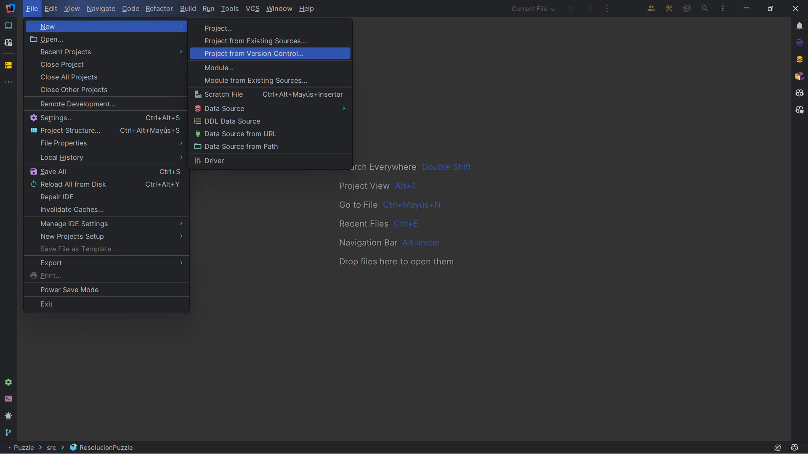
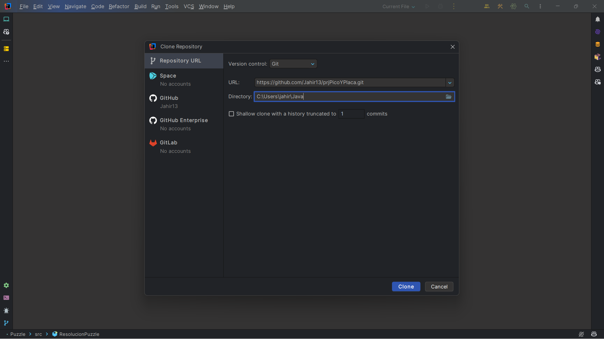
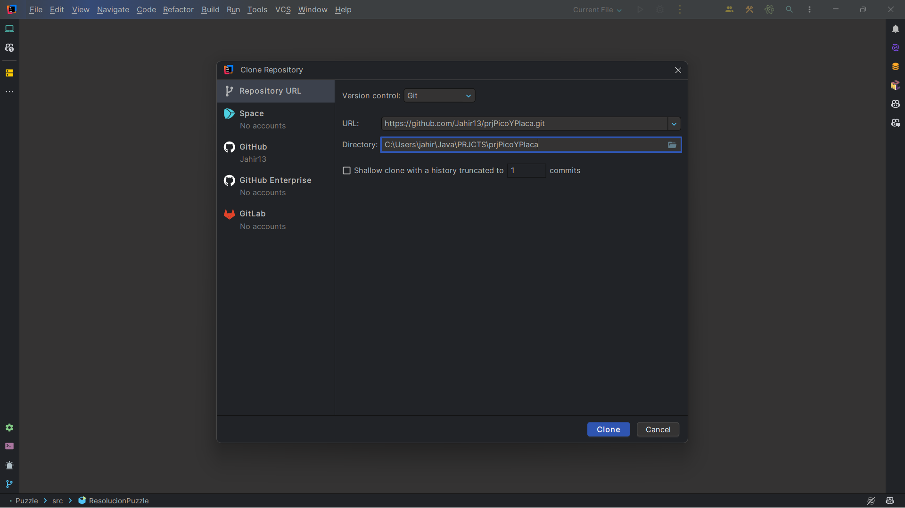
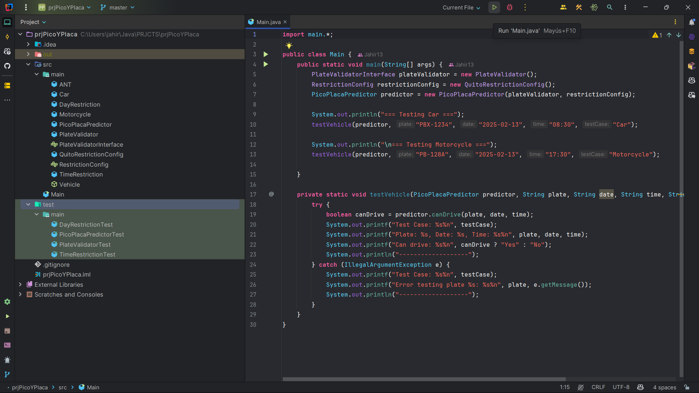
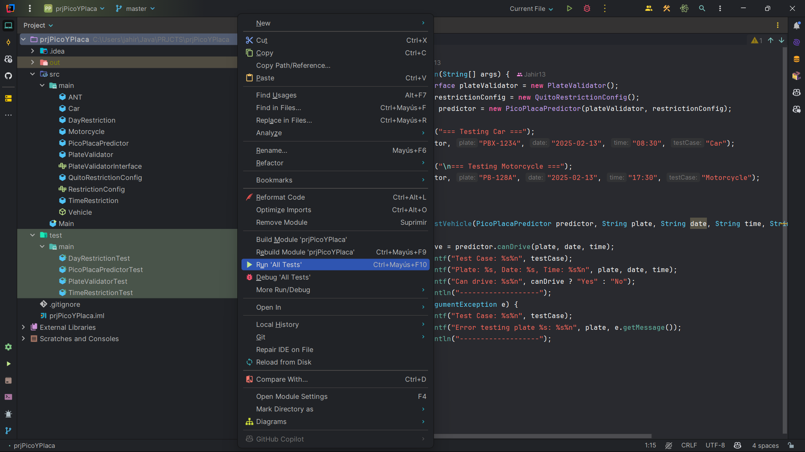

# Pico y Placa Predictor

## Overview

The Pico y Placa Predictor is a Java application designed to determine whether a vehicle can be driven on a specific date and time based on its license plate number, according to the Pico y Placa traffic restriction policy in Ecuador.

## Features

- Validates vehicle license plates according to Ecuadorian regulations.
- Determines if a vehicle can be driven based on the last digit of the license plate and the current date and time.
- Supports different vehicle types (cars and motorcycles).
- Provides a flexible configuration for restriction days and times.

## Technologies Used

- **IntelliJ IDEA 2023.2.4**: IDE used for developing the project.
- **Java 17**: The project is developed using Java 17, leveraging modern language features.
- **JUnit 5**: Used for unit testing to ensure the reliability of the code.
- **Java Time API**: Utilizes `LocalDate` and `LocalTime` for handling dates and times.

## Project Structure

- **ANT**: Utility class for vehicle registration.
- **DayRestriction**: Represents a restriction based on the day of the week and the last digit of the license plate.
- **PlateValidator**: Validates vehicle license plates.
- **PicoPlacaPredictor**: Predicts whether a vehicle can be driven based on Pico y Placa restrictions.
- **TimeRestriction**: Represents a time restriction with a start and end time.
- **Vehicle**: Abstract class for vehicles, with subclasses `Car` and `Motorcycle`.
- **QuitoPicoPlacaConfig**: Configuration class for Pico y Placa restrictions in Quito.
- **Main**: Main class for running the application and testing the predictor.

For a better understanding of the project structure, you can see the class diagram below:


## Getting Started

### Prerequisites

- Intellij IDEA (IDE) community edition or others.
- Java Development Kit (JDK) or later this project use: openjdk-21 Oracle Open.JDK 21.0.2 
- JUnit 5
- Git (for cloning the repository)

### Building the Project

1. **Clone the repository in Intellij IDEA:**
- Open Intellij IDEA and click on `Get from Version Control` as seen in the image below:



- Paste the repository URL (https://github.com/Jahir13/prjPicoYPlaca.git) and click on `Clone`:
   


- Select an empty directory where you want to save the project and click on `Clone` If you don't have an 
empty directory, you can create one called `prjPicoYPlaca`:



2. **Running the Application:**
- Go to the class 'Main' and run the application by clicking on the green play button:



- For making changes in the inputs you can modify them in the `Main` class:

```java
  // Test case for a car
  System.out.println("=== Testing Car ===");
  //testVehicle(predictor, "PBX-1234", "2025-02-13", "08:30", "Car"); old test
  //new test
  testVehicle(predictor, "XBA-5724", "2025-02-15", "07:30", "Car");
  
  // Test case for a motorcycle
  System.out.println("\n=== Testing Motorcycle ===");
  //testVehicle(predictor, "PB-128A", "2025-02-13", "17:30", "Motorcycle"); old test
  //new test
  testVehicle(predictor, "PB-128A", "2025-02-15", "16:30", "Motorcycle");
```
3. **Running the Tests:**
- Hoover the purple directory 'prjPicoYPlaca' then right-click on this directory and select `Run 'All test'`:
- If you want to see or run test individually you can go to the test directory and select the test you want to run:



## Extra
For more information about the project, you can check the [Pico y Placa Predictor](https://epnecuador-my.sharepoint.com/:b:/g/personal/jahir_rocha_epn_edu_ec/EcAdeY6gha5EgNAQnkgF9SsBOzqMFv_YIzESlhWtT9WlbA?e=XUAeBF)